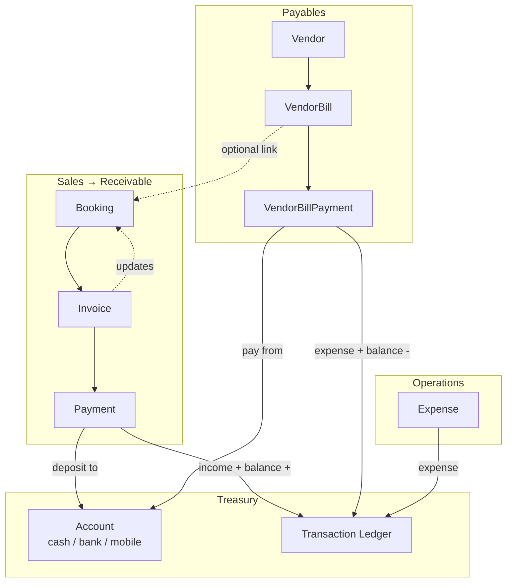

# TravelAgencyWeb (TAWSS) — Full Application Structure

> Multi-tenant travel-agency SaaS monorepo.  
> Production path: `/var/www/hearth-core-app` · PM2 `hearth-api` · Frontend `app.travelagencyweb.com`

---

## 1. High-level architecture

```
┌─────────────────────────────────────────────────────────────────────────┐
│                         Browser / Visitor                                │
└───────────────────────────────┬─────────────────────────────────────────┘
                                │ HTTPS
                                ▼
┌─────────────────────────────────────────────────────────────────────────┐
│  Frontend (Vite + React)          │  Public tenant websites              │
│  Port 8080 (dev)                  │  /site/:slug, custom domains         │
│  Built → dist/ → Nginx            │  WebsiteCustomizer branding          │
└───────────────────────────────┬─────────────────────────────────────────┘
                                │ REST JSON  /api/*
                                ▼
┌─────────────────────────────────────────────────────────────────────────┐
│  Backend (Express + Prisma)       │  Services                            │
│  Port 4000 (dev)                │  email, sms, paymentGateway,         │
│  PM2 hearth-api (prod)          │  tenantAutomation, notifications       │
└───────────────────────────────┬─────────────────────────────────────────┘
                                │ Prisma ORM
                                ▼
┌─────────────────────────────────────────────────────────────────────────┐
│  PostgreSQL 16                  │  File storage                        │
│  Multi-tenant rows (tenantId)   │  backend/uploads, website-assets     │
└─────────────────────────────────────────────────────────────────────────┘
```

See also: [architecture.md](./architecture.md), [deployment-guide.md](./deployment-guide.md), [environment-variables.md](./environment-variables.md).

---

## 2. Repository layout

```
hearth-core-app/
├── src/                          # Frontend (React + TypeScript)
│   ├── pages/                    # Route-level screens
│   ├── components/               # Reusable UI + domain widgets
│   ├── lib/                      # API clients, helpers, types
│   ├── contexts/                 # Auth, Website
│   ├── config/                   # Navigation, permissions
│   ├── i18n/                     # en.json, bn.json
│   ├── portal/                   # Agent/client portal (separate app shell)
│   └── test/                     # Vitest unit tests
├── backend/
│   ├── src/
│   │   ├── routes/               # Express route modules
│   │   ├── lib/                  # Shared backend helpers
│   │   ├── services/             # Email, SMS, payments, automation
│   │   └── middleware/           # auth, permissions, plan limits
│   ├── prisma/
│   │   ├── schema.prisma         # Database models
│   │   └── migrations/           # SQL migrations
│   └── test/                     # Node test runner
├── docs/                         # Documentation (this file)
├── scripts/                      # Deploy scripts (vps-pm2-deploy.sh)
├── app/                          # Docker compose stack (optional)
└── vps/                          # VPS deployment tooling
```

---

## 3. Database models (Prisma)

Grouped by domain. All tenant-owned tables include `tenantId`.

### 3.1 Core & auth

| Model | Purpose |
|-------|---------|
| `Tenant` | Agency account (name, phone, address, subscription, modules) |
| `TenantDomain` | Custom domain mapping |
| `User` | Staff users (roles: tenant_owner, manager, sales_agent, …) |
| `AuditLog` | Cross-module audit trail |

### 3.2 CRM & sales

| Model | Purpose |
|-------|---------|
| `Client` | Customer records |
| `ClientDocument` | Client file attachments |
| `Lead` | Sales leads |
| `LeadActivity` | Lead follow-up log |
| `Agent` | Sales agents |
| `AgentCommissionProfile` | Commission rules |
| `Task` | Internal tasks |

### 3.3 Operations

| Model | Purpose |
|-------|---------|
| `Booking` | Core booking (type: tour, ticket, hotel, visa, package, hajj, …) |
| `BookingSegment` | Multi-leg segments |
| `BookingTraveler` | Traveler manifest |
| `BookingChecklistItem` | Ops checklist |
| `BookingTimelineEvent` | Ops timeline |
| `BookingDocument` | Booking attachments |
| `BookingAgentCommission` | Per-booking commission |
| `Quotation` | Sales quotations |
| `QuotationVersion` | Quotation revisions |
| `TravelPackage` | Package catalog |
| `TravelPackageDay` / `Inclusion` / `Pricing` / `Media` | Package details |

### 3.4 Finance & transactions ★

| Model | Purpose |
|-------|---------|
| `Invoice` | Client receivable (linked to `bookingId`) |
| `InvoiceInstallment` | Payment schedule per invoice |
| `Payment` | Client payment against invoice |
| `InvoiceRefund` | Refund records |
| `InvoiceAuditEvent` | Invoice change log |
| `Vendor` | Supplier (hotel, airline, visa partner, …) |
| `VendorBill` | Payable to vendor (optional `bookingId`) |
| `VendorBillPayment` | Payment to vendor |
| `VendorNote` | Vendor interaction log |
| `Account` | Cash / bank / mobile banking account |
| `Transaction` | Ledger entry (income, expense, refund) |
| `Expense` | Operating expenses |

**Invoice fields (key):** `totalAmount`, `paidAmount`, `dueAmount`, `bookingCost`, `bookingProfit`, `status`, `dueDate`, `clientId`, `clientName`, `bookingTitle`

**Account fields:** `name`, `type` (`cash` \| `bank` \| `mobile_banking`), `balance`, `accountNumber`, `bankName`, `notes`, `status`

**Transaction fields:** `type`, `category`, `amount`, `accountId`, `referenceId`, `referenceType`, `invoiceId`, `bookingId`, `vendorId`, `clientId`, `paymentMethod`, `date`

### 3.5 Hajj / BD modules

| Model | Purpose |
|-------|---------|
| `HajjPackage`, `HajjGroup`, `HajjPilgrim`, `HajjPilgrimPayment` | Hajj operations |

### 3.6 Platform & integrations

| Model | Purpose |
|-------|---------|
| `Subscription`, `PaymentRequest`, `SubscriptionHistory` | SaaS billing |
| `SmsSettings`, `SmsTemplate`, `SmsLog` | SMS |
| `Notification`, `NotificationAutomation`, `NotificationDelivery` | In-app + automation |
| `PlatformNotification` | Super-admin notifications |
| `DemoRequest`, `ContactSubmission` | Marketing forms |

---

## 4. Finance & transaction system (detailed)

### 4.1 Conceptual flow



### 4.2 Money movement rules

| Event | Updates | Ledger |
|-------|---------|--------|
| Invoice created | `Invoice` row; optional link to `Booking` | — |
| Client payment recorded | `Payment`, `Invoice.paid/due/status`, `Booking.paymentStatus`, installments | `Transaction` type=`income`, category=`invoice_payment`; `Account.balance` += amount |
| Vendor bill created | `VendorBill` row | — |
| Vendor payment recorded | `VendorBillPayment`, bill totals/status | `Transaction` type=`expense`, category=`vendor_payment`; `Account.balance` -= amount |
| Expense approved | `Expense.status` | `Transaction` type=`expense` |
| Payment deleted | Recalc invoice + booking; reverse ledger + account | Deletes linked `Transaction` |

### 4.3 Backend files (finance)

| File | Role |
|------|------|
| `backend/src/routes/accounts.js` | Account CRUD, summary, ledger, profitability |
| `backend/src/routes/invoices.js` | Invoice CRUD, payments, refunds, installments, audit |
| `backend/src/routes/vendors.js` | Vendor CRUD, bills, bill payments, notes |
| `backend/src/routes/payments.js` | Global payment list |
| `backend/src/routes/expenses.js` | Expense CRUD + approve/reject |
| `backend/src/routes/finance.js` | Reminders |
| `backend/src/lib/accountLedger.js` | Balance sync, ledger hydration, payment hydration |
| `backend/src/lib/invoiceInstallments.js` | Installment allocation, income ledger helper |
| `backend/src/services/paymentGateway.js` | SSLCommerz, bKash, online payments |

### 4.4 API endpoints (finance)

#### Accounts — `/api/accounts`

| Method | Path | Description |
|--------|------|-------------|
| GET | `/` | List accounts |
| POST | `/` | Create account |
| PATCH | `/:id` | Update account |
| DELETE | `/:id` | Delete account |
| GET | `/summary` | Receivable, payable, cash balance, profit |
| GET | `/ledger` | Hydrated transaction list |
| GET | `/profitability` | Per-booking profit report |

#### Invoices — `/api/invoices`

| Method | Path | Description |
|--------|------|-------------|
| GET/POST | `/` | List / create |
| PATCH/DELETE | `/:id` | Edit / delete |
| PATCH | `/:id/status` | Status change (+ `cancelReason`) |
| GET/POST | `/:id/payments` | List / record payment (`accountId` optional) |
| DELETE | `/:id/payments/:payId` | Delete payment (recalc + reverse ledger) |
| GET/POST | `/:id/refunds` | Refunds |
| GET/POST/DELETE | `/:id/installments` | Installment schedule |
| GET | `/:id/audit` | Audit trail |

#### Vendors — `/api/vendors`

| Method | Path | Description |
|--------|------|-------------|
| GET/POST | `/` | List / create vendors |
| GET | `/reports/payables` | Outstanding vendor bills |
| GET/POST | `/:id/bills` | Vendor bills |
| PATCH/DELETE | `/:id/bills/:billId` | Edit / delete bill |
| POST | `/:id/bills/:billId/payments` | Pay bill (`accountId` optional) |
| GET/POST | `/:id/notes` | Vendor notes |

#### Expenses — `/api/expenses`

| Method | Path | Description |
|--------|------|-------------|
| CRUD | `/` | Standard expense management |
| POST | `/:id/approve` | Approve → ledger |
| POST | `/:id/reject` | Reject |

### 4.5 Frontend files (finance)

| File | Route | Purpose |
|------|-------|---------|
| `src/pages/Accounts.tsx` | `/accounts`, `/expenses` | Finance hub (8 tabs) |
| `src/pages/Invoices.tsx` | `/invoices`, `/payments` | Invoice list, create, edit, pay, refund |
| `src/pages/InvoiceReceipt.tsx` | `/invoices/:id/receipt` | Printable receipt + agency branding |
| `src/pages/VendorDetails.tsx` | `/vendors/:id` | Bills, pay, edit, notes |
| `src/pages/Vendors.tsx` | `/vendors` | Vendor directory |
| `src/pages/FinanceReminders.tsx` | `/finance/reminders` | Overdue reminders |
| `src/pages/Reports.tsx` | `/reports` | Financial reports |

#### Accounts tabs (`/accounts`)

| Tab | Component | Data source |
|-----|-----------|-------------|
| Overview | `AccountsOverview.tsx` | `GET /accounts/summary` |
| Receivables | `ReceivablesTab.tsx` | Invoices |
| Payments Received | `PaymentsReceivedTab.tsx` | `GET /payments` |
| Vendor Payables | `VendorPayablesTab.tsx` | `GET /vendors/reports/payables` |
| Expenses | `ExpensesTab.tsx` | `GET /expenses` |
| Cash & Bank | `CashBankAccountsTab.tsx` | Account CRUD |
| Ledger | `LedgerTab.tsx` | `GET /accounts/ledger` |
| Profitability | `ProfitabilityTab.tsx` | `GET /accounts/profitability` |

#### Shared finance components

| Component | Purpose |
|-----------|---------|
| `AccountSelect.tsx` | Pick cash/bank/mobile account on payment forms |
| `DocumentAgencyHeader.tsx` | Agency logo + contact on receipts |
| `InvoiceInstallmentsPanel.tsx` | Installment schedule UI |
| `PaymentGatewayDialog.tsx` | Online payment (SSLCommerz/bKash) |

### 4.6 Form field mapping

#### Create invoice (from booking)

| UI field | API field | Auto-filled from booking? |
|----------|-----------|---------------------------|
| Booking | `bookingId` | Yes |
| Title | `bookingTitle` | Yes (`title` or type + destination) |
| Client | `clientName` | Yes |
| Client ID | `clientId` | Yes |
| Amount | `totalAmount` | Yes (`amount`) |
| Cost | `bookingCost` | Yes (`cost`) |
| Profit | `bookingProfit` | Computed server-side |
| Due date | `dueDate` | Yes (`travelDateFrom`) |
| Notes | `notes` | Yes (`internalNotes`) |

#### Record invoice payment

| UI field | API field | Default |
|----------|-----------|---------|
| Amount | `amount` | Remaining `dueAmount` |
| Method | `method` | `cash` |
| Date | `date` | Today |
| Reference | `transactionRef` | — |
| Account | `accountId` | — (updates balance + ledger) |
| Notes | `notes` | — |

#### Create vendor bill

| UI field | API field | Notes |
|----------|-----------|-------|
| Booking | `bookingId` | `"none"` → stored as `null` |
| Description | `description` | Required |
| Amount | `totalAmount` | Required |
| Due date | `dueDate` | Optional |
| Vendor ref | `invoiceRef` | Optional |
| Notes | `notes` | Optional |

#### Create account

| UI field | API field | Type-specific |
|----------|-----------|---------------|
| Name | `name` | — |
| Type | `type` | `cash`, `bank`, `mobile_banking` |
| Opening balance | `balance` | Create only |
| Bank / provider | `bankName` | Bank + mobile |
| Account / wallet # | `accountNumber` | Bank + mobile |
| Notes | `notes` | Branch, holder, etc. |

### 4.7 Ledger categories

| `type` | `category` | Source |
|--------|------------|--------|
| `income` | `invoice_payment` | Manual invoice payment |
| `income` | `online_payment` | Payment gateway |
| `expense` | `vendor_payment` | Vendor bill payment |
| `expense` | *(expense category)* | Approved expense |
| `refund` | — | *(planned)* Invoice refund |

**Ledger filter tip:** Vendor payments use `category = vendor_payment` (not `type = vendor_payment`).

---

## 5. Booking & service operations

### 5.1 Booking types

`tour` · `ticket` · `hotel` · `visa` · `transport` · `package` · `student` · `manpower` · `corporate`

### 5.2 Key files

| Layer | Path |
|-------|------|
| UI list/create | `src/pages/Bookings.tsx` |
| UI detail | `src/pages/BookingDetails.tsx` |
| Form types | `src/components/bookings/types.ts` |
| Type-specific fields | `TicketFields`, `HotelFields`, `VisaFields`, `TourFields`, `TransportFields`, `PackageFields`, `StudentFields`, `ManpowerFields` |
| Service details JSON | `src/lib/bookingServiceDetails.ts` |
| API route | `backend/src/routes/bookings.js` |
| Service details helper | `backend/src/lib/bookingServiceDetails.js` |

### 5.3 Booking routes

| Route | Screen |
|-------|--------|
| `/bookings` | All bookings |
| `/bookings/tours` | Tour filter |
| `/bookings/tickets` | Air ticket filter |
| `/bookings/hotels` | Hotel filter |
| `/bookings/visas` | Visa filter |
| `/bookings/hajj` | Hajj filter |
| `/bookings/:id` | Booking detail |

### 5.4 Client resolution on booking create

Frontend sends `clientName` → backend `resolveClientForBooking()` finds or creates `Client` → stores `clientId`.  
(`clientName` must not be moved into `serviceDetails` — fixed in `bookingServiceDetails.js`.)

---

## 6. Full frontend route map

### 6.1 Tenant app (authenticated)

| Path | Page |
|------|------|
| `/dashboard` | Dashboard |
| `/clients`, `/clients/:id` | Clients, profile |
| `/agents`, `/agents/:id` | Agents, profile |
| `/vendors`, `/vendors/:id` | Vendors, bills & payments |
| `/leads`, `/leads/:id` | Leads |
| `/follow-ups` | Follow-ups |
| `/quotations`, `/quotations/new`, `/quotations/:id` | Quotations |
| `/packages` | Travel packages |
| `/bookings`, `/bookings/:segment` | Bookings |
| `/invoices`, `/payments` | Invoices |
| `/invoices/:id/receipt` | Payment receipt |
| `/accounts`, `/expenses` | Finance hub |
| `/reports` | Reports |
| `/hajj-umrah` | Hajj module |
| `/operations/bd` | BD operations |
| `/operations/services` | Service desk |
| `/finance/reminders` | Finance reminders |
| `/team` | Team members |
| `/organization` | Organization settings (stub) |
| `/settings` | App settings |
| `/subscription` | Plan & billing |
| `/activity-log` | Tenant audit log |
| `/notifications` | Notification delivery log |
| `/roles` | Role permissions |
| `/website` | Website builder home |
| `/website/customize` | Theme / branding |
| `/onboarding` | First-time setup wizard |
| `/user-guide` | In-app guide |

### 6.2 Super admin

| Path | Page |
|------|------|
| `/admin` | Admin dashboard |
| `/admin/tenants` | Tenant management |
| `/admin/subscriptions` | Subscription workflow |
| `/admin/payments` | Platform payments |
| `/admin/settings` | Platform settings |
| `/admin/audit` | Global audit log |

### 6.3 Public / marketing

| Path | Page |
|------|------|
| `/`, `/login`, `/register` | Landing / auth |
| `/pricing`, `/features`, `/demo` | Marketing |
| `/site/:slug` | Tenant public website |

---

## 7. Backend route modules

| File | Mount | Domain |
|------|-------|--------|
| `auth.js` | `/api/auth` | Login, register, logout |
| `tenants.js` | `/api/tenants` | Tenant profile, team, SMS settings |
| `clients.js` | `/api/clients` | Clients |
| `agents.js` | `/api/agents` | Agents + commissions |
| `vendors.js` | `/api/vendors` | Vendors + bills |
| `leads.js` | `/api/leads` | Leads |
| `quotations.js` | `/api/quotations` | Quotations |
| `bookings.js` | `/api/bookings` | Bookings |
| `invoices.js` | `/api/invoices` | Invoices + payments |
| `accounts.js` | `/api/accounts` | Accounts + ledger |
| `expenses.js` | `/api/expenses` | Expenses |
| `payments.js` | `/api/payments` | Payment list |
| `finance.js` | `/api/finance` | Reminders |
| `dashboard.js` | `/api/dashboard` | Dashboard stats |
| `hajj.js` | `/api/hajj` | Hajj module |
| `website.js` | `/api/website` | Website config + assets |
| `public.js` | `/api/public` | Public tenant API |
| `admin.js` | `/api/admin` | Super admin |
| `portal.js` | `/api/portal` | Agent portal API |
| `notifications.js` | `/api/notifications` | Notifications |
| `auditLogs.js` | `/api/audit-logs` | Audit logs |
| `crud.js` | `/api/*` | Generic CRUD fallback |

---

## 8. Permissions (finance-related)

| Module | Typical roles |
|--------|---------------|
| `invoices` | view, create, edit, delete, approve |
| `accounts` | view, create, edit, delete, export |
| `vendors` | view, create, edit, delete |
| `expenses` | view, create, edit, approve |

Defined in `src/lib/permissions.ts` · enforced via `requirePermission()` on backend.

---

## 9. Branding on documents

| Document | Branding source |
|----------|-----------------|
| Invoice receipt | `tenant` (name, phone, address) + `websiteApi.getConfig()` (logo, contactInfo) |
| Quotation print | Website builder / tenant *(placeholder — needs same header component)* |

Agency branding is configured in:
- **Onboarding** — company name, phone, address
- **Website Builder → Branding** — logo, contact section

`/organization` page is planned as a single place for this (currently a stub).

---

## 10. Recommended finance workflow

```
1. Setup accounts     →  Accounts → Cash & Bank
                         (Cash, Bank A/C, bKash, Nagad, …)

2. Create booking     →  Bookings → New
                         (client auto-created from name)

3. Bill client        →  Invoices → From Booking
                         (amount, cost, client auto-filled)

4. Receive payment    →  Invoices → Record Payment
                         · Amount = due (auto)
                         · Pick deposit account
                         · Ledger + balance updated

5. Record vendor cost →  Vendors → Bills
                         (link booking optional)

6. Pay vendor         →  Vendors → Pay
                         · Amount = due (auto)
                         · Pick pay-from account

7. Review             →  Accounts → Ledger / Overview / Profitability
```

---

## 11. Recent fixes (June 2026)

| Issue | Fix |
|-------|-----|
| Booking create: "Client is required" | Keep `clientName` out of `serviceDetails` before validation |
| Invoice create: `bookingCost` unknown | Added `bookingCost`, `bookingProfit` columns + migration |
| Vendor bill: `vendorName` unknown | Sanitize payload; hydrate names on read |
| Account balances never moved | `adjustAccountBalance()` on invoice/vendor payments |
| Ledger empty names | `hydrateLedgerTransactions()` on `/accounts/ledger` |
| No account/mobile banking UI | `CashBankAccountsTab` + `AccountSelect` |
| Invoice/bill not editable | Edit dialogs on `Invoices.tsx`, `VendorDetails.tsx` |
| Payment amount not pre-filled | Auto-fill `dueAmount` on pay dialogs |
| Cancel reason lost | Pass `cancelReason` to `PATCH /invoices/:id/status` |
| Vendor `bookingId: "none"` | Normalized to `null` |
| Receipt missing agency info | `DocumentAgencyHeader` on `InvoiceReceipt.tsx` |

---

## 12. Known gaps / roadmap

| Item | Status |
|------|--------|
| Organization page (single branding UI) | Stub at `/organization` |
| Quotation print agency header | Still placeholder text |
| Refund → ledger transaction | Not yet posted |
| Expense → account link in UI | Backend supports `accountId`; UI partial |
| Payment gateway → installment allocation | Gateway path may skip installments |
| Service-specific fields audit (all forms) | Partial — booking forms have type fields; invoice/expense need review |
| `overdue` status persistence | Client-computed; not saved server-side |

---

## 13. Dev & deploy quick reference

```bash
# Database
sudo pg_ctlcluster 16 main start
cd backend && npm run setup          # first time

# Dev servers
cd backend && npm run dev            # :4000
npm run dev                          # :8080

# Production deploy (PM2)
bash scripts/vps-pm2-deploy.sh

# Migrations
cd backend && npx prisma migrate deploy
```

| Env | Frontend | API |
|-----|----------|-----|
| Local | http://localhost:8080 | http://localhost:4000/api |
| Production | https://app.travelagencyweb.com | PM2 `hearth-api` |

---

## 14. Related docs

- [api-endpoints.md](./api-endpoints.md)
- [architecture.md](./architecture.md)
- [deployment-guide.md](./deployment-guide.md)
- [environment-variables.md](./environment-variables.md)
- [AGENTS.md](../AGENTS.md) — Cursor agent instructions

---

*Last updated: June 2026 — reflects finance/transaction overhaul and recent production fixes.*
