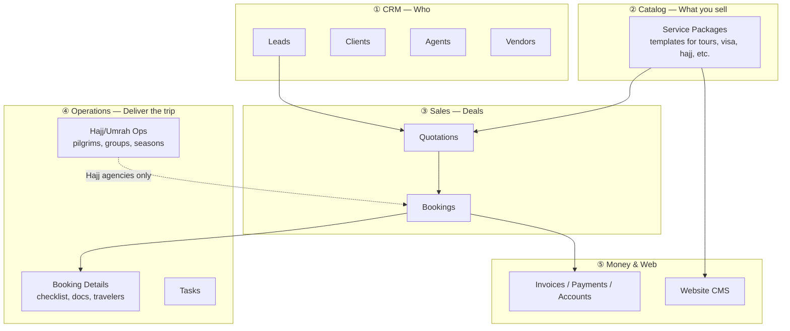
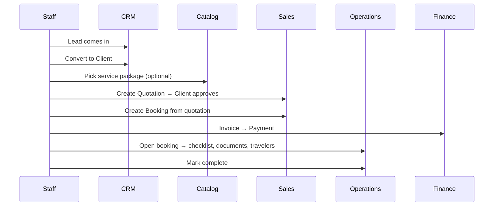
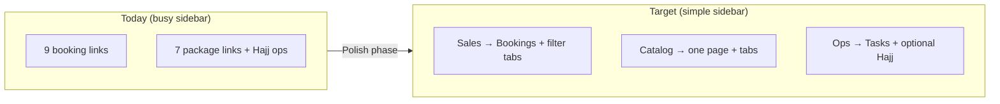

# TravelAgencyWeb — Master Blueprint (Menu, Operations & UI)

**Audience:** Agency owners and staff who are not technical experts.  
**Purpose:** One clear map of what the SaaS does today, why it feels mismatched, and the **target** structure so any agency can use it easily.

**Last updated:** 2026-06 (reflects `main` after polish phases A–D)

---

## 1. What this software is (one sentence)

A **multi-tenant travel agency ERP**: sell services → manage bookings → collect money → optionally publish a website — with **extra Hajj/Umrah operations** for pilgrimage agencies.

---

## 2. The only mental model you need — 5 pillars

Think of the product as **five layers**. Every menu item belongs to one layer.



| Pillar | Question it answers | Main screens |
|--------|---------------------|--------------|
| **CRM** | Who are we talking to / working with? | Leads, Clients, Agents, Vendors |
| **Catalog** | What services do we offer (templates & prices)? | Packages by type (`/packages/tour`, etc.) |
| **Sales** | What did the customer buy? | Quotations, Bookings |
| **Operations** | How do we deliver it? | Booking details, Tasks, Hajj/Umrah ops |
| **Money & Web** | How do we get paid & show online? | Invoices, Accounts, Website |

**Golden rule:**  
- **Package** = brochure/template (reusable).  
- **Booking** = one customer’s sale.  
- **Hajj/Umrah Operations** = many pilgrims under one season (special case).

---

## 3. Standard agency journey (works for tour, visa, hotel, etc.)



**Most agencies live in steps 1–6.** They never need Hajj/Umrah Operations unless they run pilgrimage seasons.

---

## 4. Why the menu feels confusing today

### 4.1 Duplicate ideas (same word, different meaning)

| You see in menu | Route | What it really is |
|-----------------|-------|-------------------|
| **Tour Packages** | `/packages/tour` | Catalog templates |
| **Tour Bookings** | `/bookings/tour` | Customer sales |
| **Hajj Packages** | `/packages/hajj` | Catalog templates |
| **Hajj Bookings** | `/bookings/hajj` | Customer sales |
| **Manpower Programs (BD)** | `/packages/manpower` | Catalog |
| **Manpower Bookings** | `/bookings/manpower` | Customer sales |
| **Hajj/Umrah Operations** | `/hajj-umrah` | **Separate ops desk** (pilgrims, groups) |

**Packages ≠ Bookings.** The sidebar lists both for each category, so the menu looks twice as long as necessary.

### 4.2 Hajj is special (historical)

Hajj/Umrah was built **before** the unified Packages + Bookings design. It has its own:

- Season packages (Hajj 2028)
- Groups & pilgrims
- Collection / due / visa stats

Other categories use **Booking Details** for operations, not a second app.

### 4.3 Partial features look “missing”

| Planned in blueprint | Status today |
|----------------------|--------------|
| Follow-ups (CRM) | Inside Lead details only — no list page |
| Documents hub | Client profile + booking uploads — no `/documents` module |
| Expenses / Commissions (Finance menu) | Inside Accounts & Agents — not top-level |
| Help Center | User Guide only |
| Student / Manpower **ops desk** | Booking fields only — no `/operations/student` |

---

## 5. Current menu (as deployed) — honest map

```
Dashboard
CRM          → Leads, Clients, Agents, Vendors, Quotations
Bookings     → All, Tour, Flight, Hotel, Hajj, Umrah, Visa, Student, Manpower  ← SALES
Packages     → Tour, Hajj, Umrah, Visa, Hotel, Student, Manpower + Hajj Ops   ← CATALOG + special ops
Support      → Tasks
Finance      → Invoices, Payments, Accounts, Reports
Website CMS  → Home, Theme Builder, Publish
Admin        → Team, Roles, Notifications, Settings, Org, Subscription, User Guide
Super Admin  → /admin/* (platform owner only)
```

**Quotations** sit under CRM but are really **Sales** — another small mismatch.

---

## 6. Target menu — simple for any agency (recommended polish)

This is the **standard** layout we should move toward. One group = one pillar.

```
📊 Dashboard

👥 CRM
   Leads · Clients · Agents · Vendors

💼 Sales
   Quotations · Bookings (one page, filter by type: Tour / Flight / Hotel / Visa / …)

📦 Service catalog          ← single entry, tabs inside (not 7 sidebar lines)
   All · Tour · Hajj · Umrah · Visa · Hotel · Student · Manpower

⚙️ Operations
   Tasks · Documents (future)
   Hajj/Umrah Operations     ← only if tenant enables “Hajj module”

💰 Finance
   Invoices · Payments · Expenses · Commissions · Accounts · Reports

🌐 Website
   Pages · Theme · Publish · Domain

🔧 Settings
   Team · Roles · Notifications · Organization · Subscription · Guide
```



---

## 7. Service type matrix — what each category uses

| Service | Catalog page | Sales (booking) | Operations | Finance |
|---------|--------------|-----------------|------------|---------|
| **Tour** | ✅ `/packages/tour` | ✅ `/bookings/tour` + Tour fields | ✅ Booking details | ✅ Invoice |
| **Flight** | ✅ (air ticket type) | ✅ `/bookings/flight` + Ticket fields | ✅ Booking details | ✅ |
| **Hotel** | ✅ | ✅ + Hotel fields | ✅ Booking details | ✅ |
| **Visa** | ✅ | ✅ + Visa fields | ✅ Docs on client/booking | ✅ |
| **Hajj/Umrah sale** | ✅ | ✅ `/bookings/hajj` or `umrah` | ✅ **Also** `/hajj-umrah` for pilgrims | ✅ |
| **Student (BD)** | ✅ | ✅ + Student fields | ✅ `/operations/bd` (optional module) | ✅ |
| **Manpower (BD)** | ✅ | ✅ + Manpower fields | ✅ `/operations/bd` (optional module) | ✅ |

**Legend:** ✅ built · ⚠️ partial · ❌ not built

---

## 8. Who uses what (by role)

| Role | Daily screens |
|------|----------------|
| **Sales / front desk** | Leads → Clients → Quotations → Bookings |
| **Operations** | Bookings (open each) → Tasks; Hajj desk → `/hajj-umrah` |
| **Accounts** | Invoices → Payments → Accounts → Reports |
| **Manager** | Dashboard + Reports + Agents (commissions) |
| **Owner** | Settings, Team, Subscription, Website |

---

## 9. Screen glossary (plain English)

| Screen | When to use |
|--------|-------------|
| **Dashboard** | Today’s overview — leads, bookings, revenue snapshot |
| **Leads** | Enquiries not yet customers |
| **Clients** | Your customer database + their documents |
| **Agents** | Sub-agents / partners + commission |
| **Vendors** | Suppliers you pay (hotels, airlines, etc.) |
| **Quotations** | Price quote before confirming sale |
| **Bookings** | Confirmed sale — always start here for non-Hajj ops |
| **Booking details** | One booking: travelers, segments, checklist, upload docs |
| **Packages (catalog)** | Templates for website & quotations — not individual sales |
| **Hajj/Umrah Operations** | Season + groups + pilgrims — Hajj agencies only |
| **Invoices / Payments** | Bill customer & record money in |
| **Accounts** | Ledger, expenses, vendor payables, profitability |
| **Website** | Public site content for your agency |
| **Tasks** | Internal to-do / follow-ups for team |
| **Follow-ups** | Scheduled callbacks and reminders (`/follow-ups`) |
| **Documents hub** | All uploaded files across bookings and clients (`/documents`) |
| **Activity log** | Who changed what — owners/managers only (`/activity-log`) |

---

## 10. Polish roadmap (development priority)

**Status: Phases A–D shipped on `main` (Jun 2026). Phases 1–4 shipped (catalog, UX, service ops, finance).** Next: scenario Phase 5.

### Phase A — Clarity — ✅ shipped

1. **Sidebar:** Sales group = Quotations + Bookings (move quotations out of CRM label).
2. **Sidebar:** One **Service catalog** item → tabs inside (hide 7 duplicate package links).
3. **In-app help:** Short “Packages vs Bookings vs Hajj Ops” banner on first visit.
4. **Tenant setting:** “Enable Hajj/Umrah Operations module” — hide `/hajj-umrah` for pure tour agencies.
5. **Rename consistently (EN/BN):** always “X Bookings” vs “X Programs/Packages”.

### Phase B — Complete the blueprint — ✅ shipped

6. Follow-ups list (`/follow-ups`)
7. Documents hub (`/documents`)
8. Finance: Expenses & Commissions as menu items (route to Accounts / Agents tabs)

### Phase C — BD market depth — ✅ shipped

9. Student / Manpower operations desk (optional module like Hajj)
10. Package ↔ website auto-sync status UI

### Phase D — Super admin / platform — ✅ shipped

11. Align GitHub deploy + VPS PM2 path
12. Activity logs for tenant admins

---

## 11. Quick decision guide (for you)

**Ask yourself:**

1. **Do we sell Hajj/Umrah with many pilgrims per season?**  
   - Yes → Use **Bookings (Hajj/Umrah)** + **Hajj/Umrah Operations**.  
   - No → Ignore Operations; use **Bookings** only.

2. **Are we setting up what we sell on the website?**  
   - Use **Service catalog (Packages)**, then **Website**.

3. **Did the customer agree to buy?**  
   - Create **Booking** → **Invoice** → open **Booking details** for delivery.

4. **Is this only a price estimate?**  
   - **Quotation** first.

---

## 12. Related docs

- `docs/sidebar-routes-implementation-plan.md` — technical route/sidebar phases (P0–P3)
- `docs/deployment-guide.md` — VPS / production
- In-app: **User Guide** (`/user-guide`)

---

## 13. Summary

| Problem | Cause | Fix direction |
|---------|--------|---------------|
| Menu too long | Packages + Bookings duplicated per category | One catalog page + one bookings page with filters |
| Hajj feels different | Extra operations module | Optional module + clear labels |
| “Where do I operate?” | No single rule | **Bookings → open row → details**; Hajj bulk → **Hajj Ops** |
| Missing items in menu | Polish phases A–D now shipped | Next: audit plan Phase 0 (security) |

**For most daily work:** CRM → Sales (Quotation/Booking) → Finance.  
**Catalog & Website:** when marketing or updating offers.  
**Hajj Operations:** only for pilgrimage seasons at scale.
