# TravelAgencyWeb (TAWSS) — Final Master Plan (Revised)

**Version:** 1.1 · **Date:** June 2026  
**Audience:** Product owner, developers, agency owners, sales/ops staff  
**Goal:** **এজেন্ট-ফ্রেন্ডলি** travel ERP — যেকোনো এজেন্সি **৫ মিনিটে** দৈনন্দিন কাজ শুরু করতে পারবে।

**Related docs:** `saas-master-blueprint.md` · `final-travel-saas-scenario.md` · `serviceCatalog.ts`

**সচেতকভাবে বাদ (এই প্ল্যানে নেই):**
- Arabic / RTL UI
- Multi-currency
- Hotel allotment / contract module
- Stripe / international card gateways

**পেমেন্ট ফোকাস:** bKash · SSLCommerz · bank transfer · manual proof + admin approve (বাংলাদেশ মার্কেট)

---

## 1. এক লাইনে ভিশন

> **“Lead থেকে Payment — এক জায়গায়। ১৪টি সার্ভিস ক্যাটাগরি সাইনআপে বেছে নিন, দৈনন্দিন কাজ একই ৬ ধাপে।”**

| Dimension | TAWSS positioning |
|-----------|-------------------|
| **Market** | Bangladesh-first, EN/BN — global-ready architecture without extra i18n/pay scope |
| **vs Travel Suite ERP** | Unified booking flow; **broader signup catalog** (14 + 135) |
| **vs Hajj-only tools** | Hajj depth + visa, ticket, tour, manpower, study, corporate |
| **vs spreadsheets** | Cloud ERP + agency website + multi-tenant SaaS |

---

## 2. সাইনআপ সার্ভিস ক্যাটালগ (আসল সংখ্যা)

`Register` Step 2 → `ServiceCatalogPicker` (`src/lib/serviceCatalog.ts`)

| স্তর | সংখ্যা |
|------|--------|
| **মূল ক্যাটাগরি** | **১৪** |
| **সাব-ক্যাটাগরি** | **১৩৫** |
| **Agency preset** | **৬** |

### ১৪টি মূল ক্যাটাগরি

| # | Category | বাংলা |
|---|----------|-------|
| 1 | Air Ticketing | এয়ার টিকেটিং |
| 2 | Hajj & Umrah | হজ্জ ও উমরাহ |
| 3 | Visa Processing | ভিসা প্রসেসিং |
| 4 | Manpower & Overseas Employment | ম্যানপাওয়ার |
| 5 | Hotel & Accommodation | হোটেল ও আবাসন |
| 6 | Transportation | ট্রান্সপোর্ট |
| 7 | Tour Packages | ট্যুর প্যাকেজ |
| 8 | Cruise & Holiday | ক্রুজ ও হলিডে |
| 9 | Study Abroad | স্টাডি অ্যাবরড |
| 10 | Corporate Travel | কর্পোরেট ট্রাভেল |
| 11 | Travel Documentation | পাসপোর্ট / অ্যাটেস্টেশন |
| 12 | Event & Attraction Tickets | ইভেন্ট টিকেট |
| 13 | Travel Insurance | ট্রাভেল ইন্স্যুরেন্স |
| 14 | Additional Services | eSIM, lounge, concierge… |

### ৬টি Preset (দ্রুত বাছাই)

Hajj Agency · Tour Agency · Visa Center · Manpower Agency · Study Consultancy · Full Service

→ নির্বাচিত সাব-ক্যাটাগরি থেকে `enabledServiceTypes` তৈরি হয় → **মেনু ও বুকিং টাইপ ফিল্টার** হয়।

---

## 3. এজেন্টের একমাত্র নিয়ম (৬ ধাপ)

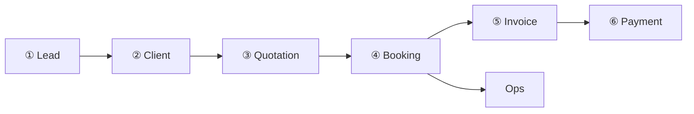

| ধাপ | স্ক্রিন |
|-----|--------|
| ① Lead | Leads |
| ② Client | Clients |
| ③ Quotation | Quotations |
| ④ Booking | Bookings |
| ⑤ Invoice | Invoices |
| ⑥ Payment | Payments |
| Ops | Booking Details / Ops desk |

**স্বর্ণ নিয়ম:** Package = ক্যাটালগ টেমপ্লেট · Booking = আসল বিক্রি · Hajj Ops = বড় সিজন/গ্রুপ ম্যানেজমেন্ট

---

## 4. টার্গেট সাইডবার (৭ গ্রুপ — সহজ)

```
📊 Dashboard
👥 CRM          — Leads · Clients · Agents · Vendors
💼 Sales        — Quotations · Bookings (এক পেজ, ট্যাব)
📦 Catalog      — Packages (১৪ ক্যাটাগরি ট্যাব)
⚙️ Operations   — Tasks · Documents · Visa/Ticket desk · Hajj Ops (optional)
💰 Finance      — Invoices · Payments · Accounts · Reports
🌐 Website      — Theme · Publish · Domain
🔧 Settings     — Team · Roles · Subscription · Guide
```

**Agent-First নিয়ম:** ৭ গ্রুপ · Next Step বাটন · Onboarding = ১৪ ক্যাটাগরি preset · অপ্রয়োজনীয় মডিউল লুকানো

---

## 5. Travel Suite vs TAWSS (আপডেট)

| Module | TAWSS আজ | প্ল্যান |
|--------|----------|---------|
| Sales & Quotation | ✅ | Next-step UX |
| CRM | ✅ | Pipeline + lead source |
| Booking | ✅ | Single page + tabs |
| Tour / Package | ✅ | Catalog tabs |
| Flight | ⚠️ PNR booking | **Ticket ops desk** (P2) |
| Hotel | ⚠️ booking fields | **Hotel ops desk** (P2) — allotment নয় |
| Visa | ⚠️ | **Visa ops desk** (P2) |
| Hajj/Umrah | ✅ গভীর | Simplify entry |
| Tasks | ✅ | Link to booking |
| Support Tickets | ❌ | P2 |
| HRM | ❌ | P2 light |
| Website CMS | ✅ | Blog P2 |
| Analytics | ✅ আংশিক | KPI by service P2 |
| **TAWSS extra** SaaS + SMS + 14-category signup | ✅ | Core USP |

---

## 6. মার্কেট ফোকাস (বাংলাদেশ-সেন্ট্রিক)

| Segment | Default preset | Payment |
|---------|----------------|---------|
| Hajj/Umrah agency | `hajj_agency` | bKash, bank |
| Visa center | `visa_center` | bKash, bank |
| Tour agency | `tour_agency` | bKash, SSLCommerz |
| Manpower | `manpower_agency` | bank, cash |
| Study consultancy | `study_consultancy` | bank |
| Full service | `full_service` | hybrid |

**Onboarding (৪ প্রশ্ন):**
1. Preset বা কাস্টম সার্ভিস (১৪ ক্যাটাগরি)
2. দৈনিক বুকিং ভলিউম (মেনু গভীরতা)
3. ভাষা EN / BN
4. bKash / SSLCommerz চালু করবেন?

---

## 7. রোল গাইড

| Role | দৈনিক |
|------|-------|
| Sales | Leads → Quote → Booking |
| Ops | Bookings → Ops tab / Service desk |
| Visa officer | Visa desk queue |
| Ticket officer | Ticket desk (PNR) |
| Accounts | Invoice → Payment → Reports |
| Hajj coord | Hajj/Umrah Ops |
| Owner | Dashboard, Subscription, Website |

---

## 8. প্রোডাক্ট রোডম্যাপ — ৩ ফেজ (রিভাইজড)

### Phase 1 — খুব সহজ (০–৮ সপ্তাহ) · **#1 অগ্রাধিকার**

| ID | Deliverable |
|----|-------------|
| 1.1 | Sidebar → ৭ গ্রুপ মেনু |
| 1.2 | Onboarding wizard (৬ preset + ১৪ ক্যাটাগরি picker) |
| 1.3 | Bookings — single page + type tabs |
| 1.4 | Catalog — single page + category tabs |
| 1.5 | Next Step: Lead→Quote→Book→Invoice |
| 1.6 | Trial **৭ দিন** + renewal SMS/email |
| 1.7 | **bKash + SSLCommerz** production |
| 1.8 | BN video guide (৩ মিন) + dashboard checklist |
| 1.9 | Empty states + human error messages (BN) |

### Phase 2 — Travel Suite parity + conversion (২–৪ মাস)

| ID | Deliverable |
|----|-------------|
| 2.1 | **Visa Operations desk** — embassy queue, status columns |
| 2.2 | **Ticket Operations desk** — PNR, reissue, refund workflow |
| 2.3 | **Hotel Operations desk** — confirmation, voucher (booking-based, no allotment) |
| 2.4 | **Support Ticket** — client complaint → assign → resolve |
| 2.5 | **Light HRM** — staff profile, attendance, leave (payroll নয়) |
| 2.6 | **B2B Agent Portal UI** — commission wallet |
| 2.7 | Website **Blog / News** |
| 2.8 | Dashboard KPI by **১৪ ক্যাটাগরি / booking type** |
| 2.9 | Lead **pipeline** + source report |
| 2.10 | **Corporate travel** basic (company client, monthly invoice summary) |

### Phase 3 — প্ল্যাটফর্ম শক্তি (৪–৮ মাস)

| ID | Deliverable |
|----|-------------|
| 3.1 | Marketing automation — drip SMS/email on trial day 1/2/last |
| 3.2 | WhatsApp template library (renewal, payment reminder) |
| 3.3 | Coupon / promo on subscription |
| 3.4 | **Student / Manpower ops desk** polish (`/operations/bd`) |
| 3.5 | Package ↔ website sync status UI |
| 3.6 | Super admin: tenant health score (active, expired, last login) |
| 3.7 | Mobile-friendly PWA shortcuts (ops notifications) |
| 3.8 | Optional: **GDS / flight API** partner (premium tier only — later decision) |

**স্পষ্ট বাদ:** Arabic UI · Multi-currency · Hotel allotment · Stripe

---

## 9. কমার্শিয়াল প্ল্যান

| Item | Plan |
|------|------|
| Trial | ৭ দিন Pro |
| Activation | bKash / SSLCommerz / bank proof → admin approve |
| Renewal | Auto-expire + SMS/WA (built) |
| Follow-up | Bulk notify from Subscriptions admin |
| Metrics | Signup→first booking 48h · Trial→paid 30d |

---

## 10. নতুন এজেন্সি — ৭ দিন

| Day | Action |
|-----|--------|
| D0 | Signup + **preset/service pick** (১৪ ক্যাটাগরি) |
| D1 | 1 Lead + 1 Client |
| D2 | 1 Quotation (catalog template) |
| D3 | 1 Booking |
| D4 | Invoice + Payment |
| D5 | Website publish |
| D6 | 1 team member (role preset) |
| D7 | Reports review |

---

## 11. টেক অ্যাংকর (ভাঙবেন না)

```
Lead → Quotation → Booking → Invoice → Payment → Account → Report → Website
```

- `enabledSubcategories` (১৩৫) → menu filter  
- `serviceDetails` JSON on Booking  
- Multi-tenant `tenantId`  
- Additive migrations only  

---

## 12. অগ্রাধিকার এক নজরে

| # | Focus |
|---|--------|
| **1** | সহজ UX — ৭ গ্রুপ মেনু, ৬ ধাপ, onboarding (১৪ ক্যাটাগরি) |
| **2** | Conversion — trial ৭d, bKash/SSLCommerz, renewal follow-up |
| **3** | Ops desks — Visa, Ticket, Hotel (booking-based) |
| **4** | Support ticket + light HRM + B2B portal |
| **5** | Marketing automation + platform analytics |

---

## 13. FAQ

| প্রশ্ন | উত্তর |
|--------|--------|
| সাইনআপে কত সার্ভিস? | **১৪ ক্যাটাগরি, ১৩৫ সাব-সার্ভিস, ৬ preset** |
| Arabic / Stripe? | **এই প্ল্যানে নেই** |
| Hotel allotment? | **নেই** — hotel booking + ops desk যথেষ্ট |
| Hajj এজেন্সি শুরু? | Preset `hajj_agency` → Leads → Bookings → Hajj Ops |
| Trial বন্ধ? | না — ৭ দিন |

---

## 14. Appendix — Flowcharts & Organograms

### A1. Master organogram (platform → tenant)

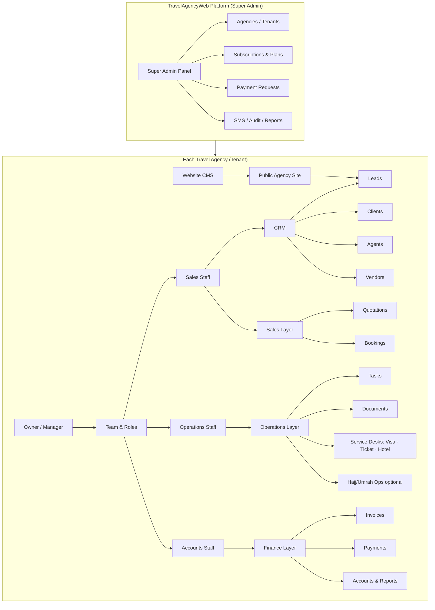

### A2. Agent daily flow (6 steps)

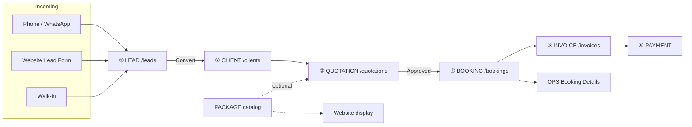

### A3. Signup → menu config (14 categories)

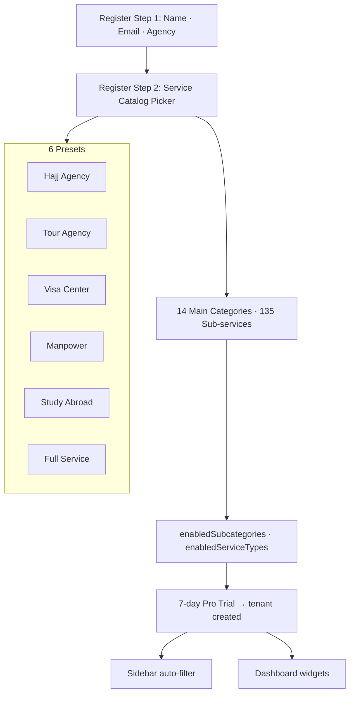

### A4. Catalog → booking type mapping

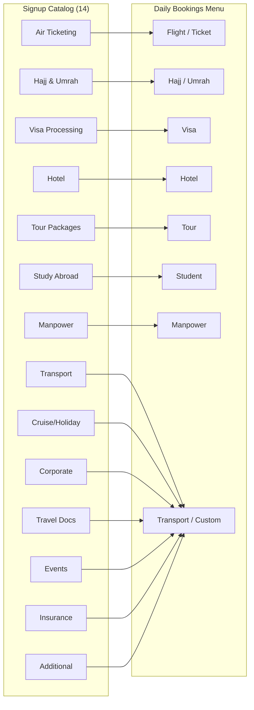

### A5. Target sidebar (7 groups)

```mermaid
flowchart TB
  ROOT[TravelAgencyWeb ERP]

  ROOT --> D[Dashboard]
  ROOT --> CRM[CRM]
  ROOT --> SALES[Sales]
  ROOT --> CAT[Service Catalog]
  ROOT --> OPS[Operations]
  ROOT --> FIN[Finance]
  ROOT --> WEB[Website]
  ROOT --> SET[Settings]

  CRM --> L[Leads]
  CRM --> CL[Clients]
  CRM --> AG[Agents]
  CRM --> VE[Vendors]

  SALES --> QU[Quotations]
  SALES --> BK[Bookings tabs]

  CAT --> PK[Packages tabs by category]

  OPS --> TK[Tasks]
  OPS --> DC[Documents]
  OPS --> VD[Visa Desk]
  OPS --> TD[Ticket Desk]
  OPS --> HD[Hotel Desk]
  OPS --> HJ[Hajj/Umrah Ops]

  FIN --> IV[Invoices]
  FIN --> PY[Payments]
  FIN --> AC[Accounts]
  FIN --> RP[Reports]

  WEB --> TH[Theme Builder]
  WEB --> PB[Publish]
  WEB --> DM[Domain]

  SET --> TM[Team]
  SET --> RL[Roles]
  SET --> SB[Subscription]
  SET --> UG[User Guide]
```

### A6. Role organogram

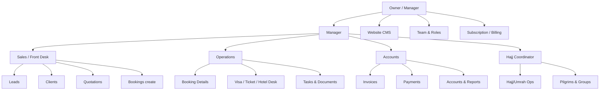

### A7. Hajj agency dual path

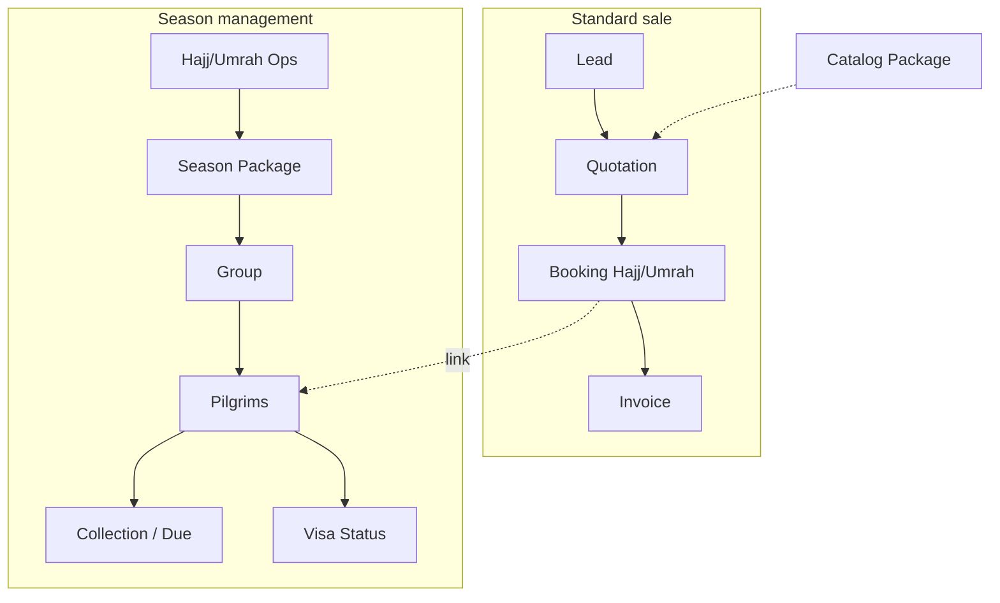

### A8. SaaS commercial flow (trial → paid)

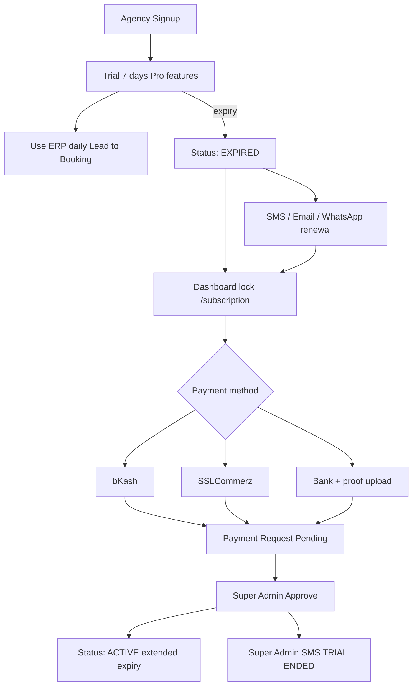

### A9. Technical stack

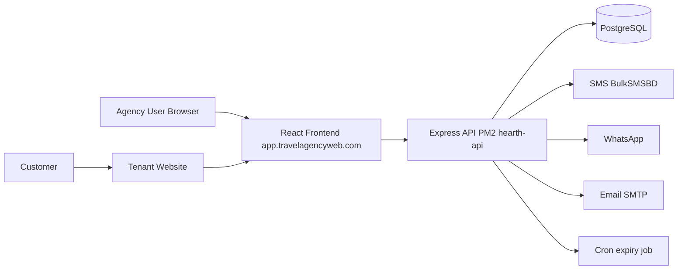

### A10. Revised roadmap phases

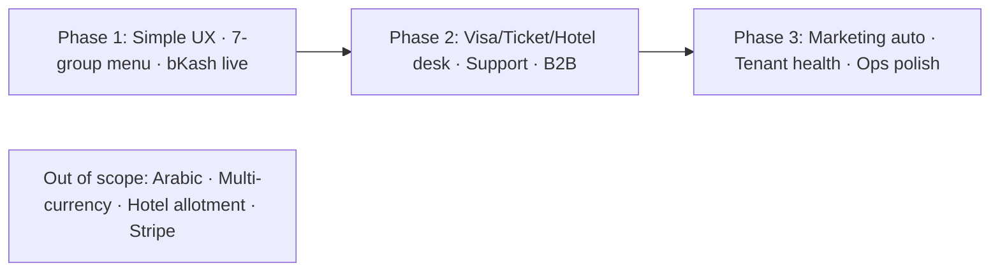

| Diagram | Shows |
|---------|--------|
| A1 | Platform → Tenant → Departments |
| A2 | **6-step** agent daily flow |
| A3 | Signup + **14 categories / 135 subs** |
| A4 | Catalog → Booking type mapping |
| A5 | **Target sidebar** (7 groups) |
| A6 | Role organogram |
| A7 | Hajj dual path |
| A8 | Trial → Paid SaaS |
| A9 | Tech stack |
| A10 | 3-phase roadmap |

---

*Implementation tickets: `WMP-1.1`, `WMP-2.1`, etc. · Maintainer: update on phase ship.*
